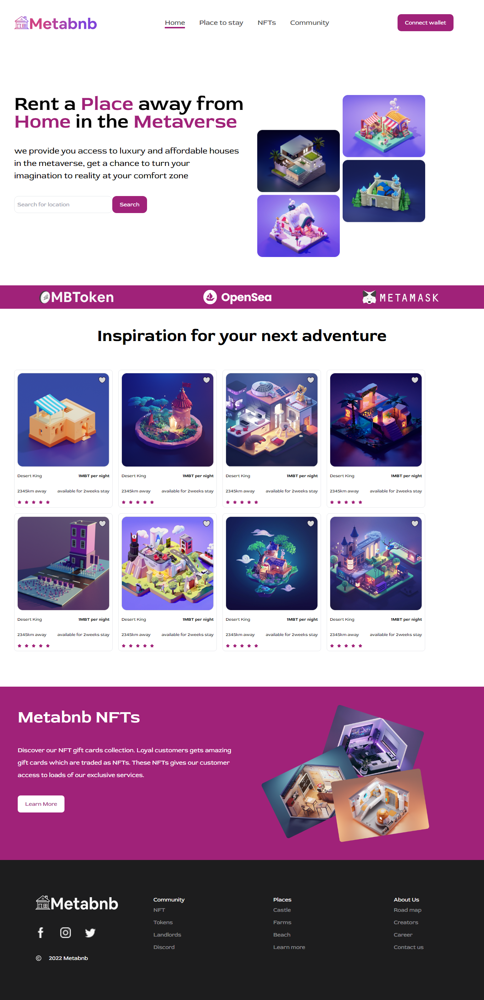

# METABNB WEP APPLICATION

>This web application displays Metabnb information. User can filter search by some parameters such as Location and name and will be able to search individual media items using item properties such as distance, off-grid, farm etc.



## BUILT WITH

-- Basic Language - JavaScript 
- Framework - React
- Other technologies/tools: 

``` create-react-app
    > create-react-app
    > webpack for bundling files
    > Babel for code transpiling
    > Git for version control
    > Eslint for JavaScript linting
    > Stylelint for style linting
    > Jest for testing
    > SASS and Tailwind for styling
 ```

## Live Demo

[Live Demo Link](https://metabnb-ten.vercel.app/)

[Figma Design Link](https://www.figma.com/file/OQ0TTzCJ7I3kzXUQDb8k45/Metabnb-for-frontend-(Copy)?node-id=1%3A250&t=7gODkvQvWr3oZmoF-0)

## Getting Started

To get a local copy up and running follow these simple example steps.

1. Clone the repository using

```
git clone https://github.com/KingsleyIbe/metabnb.git
```

2. cd into the cloned repository

```
cd metabnb
```

3. You now have the access to the files on your local machine!

#### Optional steps

Install the node_modules/ folder to be able to locally run the linter commands. Run:

```
npm install
```


To check Stylelint linter errors run:

```
npx stylelint "**/*.scss"
```

To check ESLint errors run:

```
npx eslint .
```

To check Test run:

```
npm test
```

## 👤 **Author**

- [GitHub](https://github.com/kingsleyibe)
- [Twitter](https://twitter.com/ibekingsley2)
- [LinkedIn](https://www.linkedin.com/in/kingsley-ibe-5669a5134/)

## 🤝 Contributing

Contributions, issues, and feature requests are welcome!

Feel free to check the [issues page](https://github.com/KingsleyIbe/metabnb/issues).

## Show your support

Give a ⭐️ if you like this project!

## Acknowledgement
- Zuri
- HNG9

## 📝 License

This project is [MIT](./MIT.md) licensed.
